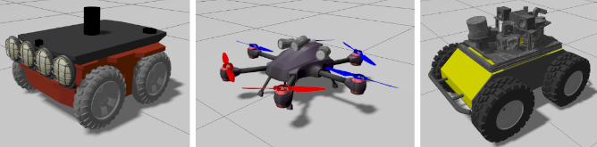
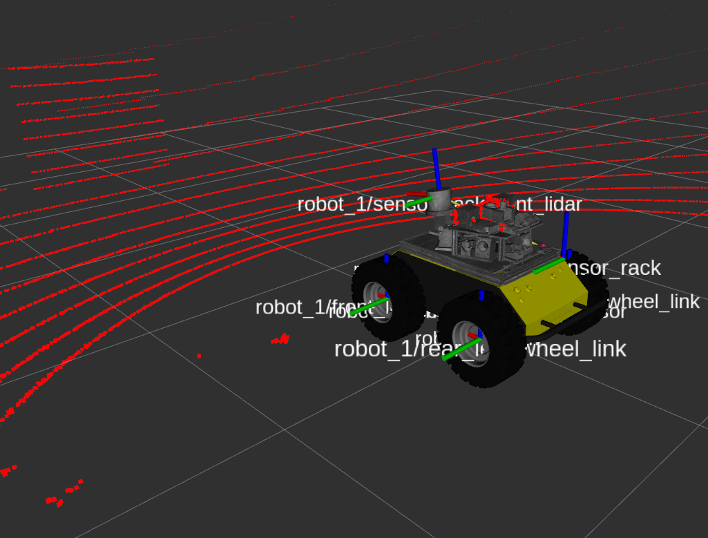

# [Table of Contents](#table-of-contents)

- [Motivation](docs/motivation.md)
- [Setup](docs/working_environment.md)
- [Usage](docs/usage.md)
- [Robots](docs/robots.md)
- [Contributing](docs/contributing.md)

## [ROS-Jazzy-Multi-robot-Sandbox](#ros-jazzy-multi-robot-sandbox)

This package for ROS 2 Jazzy Jalisco and Ubuntu 24.04 has a deployment that allows you to work with multiple robots in Ignition Gazebo. It provides you an environment for heterogeneous robots, UAVS and UGVS, that publishes the correct transformation trees and topics to controll mobile robots out-of-the-box. It might help you to further your research or development faster without prior knowledge necessary to configure simulations within the ROS 2 environment, such as operational systems, computer networks, parallel computing, simulations architectures, linear algebra, and so on.

## [What to Expect?](#what-to-expect)

### UGVs and UAV from Fuel already configured to work with ROS Jazzy in Ubuntu 24.04 and Ignition Gazebo to accelerate your work or research.



### Parameterized namespaces through python launch files for correct transform trees and integration with ```gazebo_ros_bridge```.



### Out-of-the-box for you ROS 2 Jazzy environment for ```Multi-robot applications``` and a seamless integration with visualization softwares like RViz2 to further accelerate your development.

## [Packages](#packages)

- [multi-robot-simulations](docs/multi-robot-simulations.md)

## [Publications](#publications)

If this package is somehow useful to you, consider reading this [letter](docs/motivation.md) and mentioning this ongoing research.

> A. R. da Silva, L. Chaimowicz, T. C. Silva, and A. Hsieh, Communication-Constrained Multi-Robot Exploration with Intermittent Rendezvous. 2023.

```text
@misc{dasilva2023communicationconstrained,
      title={Communication-Constrained Multi-Robot Exploration with Intermittent Rendezvous}, 
      author={Alysson Ribeiro da Silva and Luiz Chaimowicz and Thales Costa Silva and Ani Hsieh},
      year={2023},
      eprint={2309.13494},
      archivePrefix={arXiv},
      primaryClass={cs.RO}
}
```

## [License](#license)

All content from this repository is released under a anti-ai modified [BSD 4-clause license](LICENSE).

Author/Maintainer:

- [Alysson Ribeiro da Silva](https://alysson.thegeneralsolution.com/)

emails:

- <multirobotplayground@gmail.com>
- <alysson.ribeiro.silva@gmail.com>

## [Bug & Feature Requests](#bug--feature-requests)

Please report bugs and do your requests to add new features through the [Issue Tracker](https://github.com/multirobotplayground/Multi-robot-Intermittent-Rendezvous/issues).
