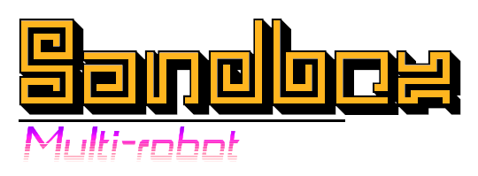
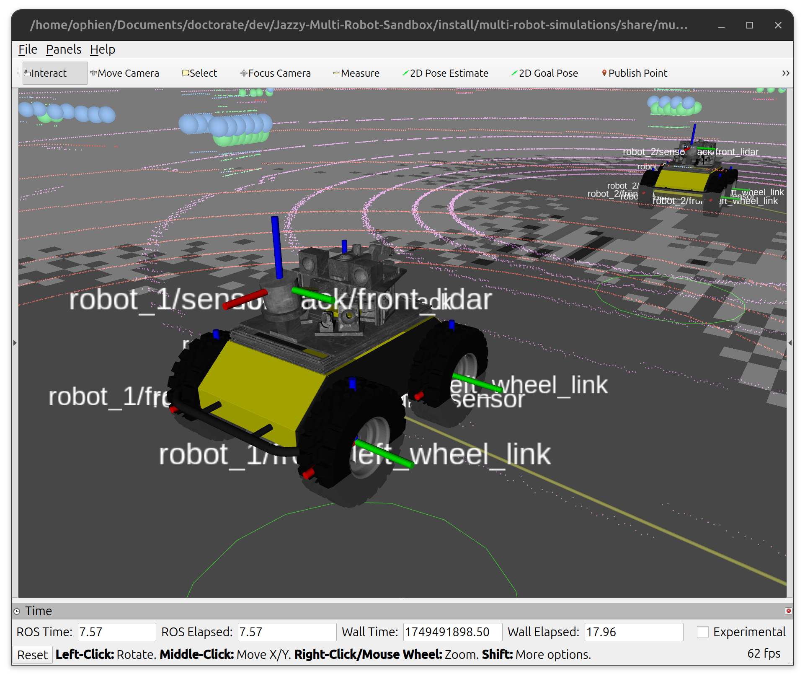
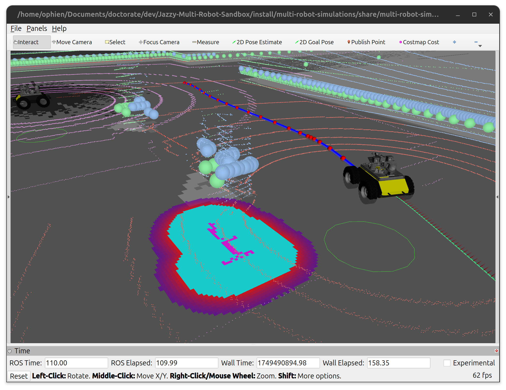

  

# [Demonstrations](#table-of-contents)

- [Ignition Simulator Namespacing](docs/integrations/gz_ignition_brige/main.md)
- [Heterogeneous Teams](docs/integrations/heterogeneous_teams/main.md)
- [Multi-robot Slam_toolbox and Nav2](docs/integrations/slam_toolbox_and_nav2/main.md)
- [Frontier Discovery](docs/integrations/frontier_discovery/main.md)

## [What to Expect from this Repository?](#what-to-expect)

- Demonstrations on how to work with multiple robots in ROS 2.
- Multi-robot exploration and related algorithms
- Multi-robot intermittent map sharing and planned rendezvous for the assigned mission
- Center of Masses Frontier Discovery

  
  

> Click on the image below for a demonstration. Or watch through this link: [https://www.youtube.com/watch?v=4ULRDRlOOw4](https://www.youtube.com/watch?v=4ULRDRlOOw4)

  

## [Features Roadmap](#features-roadmap)

Here's a look at what's coming up, what's in progress, and what's already done for this project:

| Feature | Status |
|---|---|
| Enhance Documentation | 🟡 In Progress |
| [ROS Adapt Algorithms From ROS 1 Noetic](https://github.com/multirobotplayground/Noetic-Multi-Robot-Sandbox) | 🟡 In Progress |
| [Add Real World Deployment](https://youtu.be/8FP3UK7kpRA?feature=shared) | 🔴 Stalled |
| Youtube Channel | 🔴 Stalled |
| Add Robust Testing | 🔴 Stalled |
| Add Probabilistic-based Global Planner | 🟢 Done |
| Add Pose Graph-based Mapping | 🟢 Done |
| Add Pose Graph Merging | 🟡 In Progress |
| Add Heterogeneous Robot Teams Support | 🟢 Done |
| Add Human Computer Interfaces for Ground Teams | 🔴 Stalled |
| Add Mission Assignment and Inspector | 🔴 Stalled |
| Add Other Baselines and Algorithms | 🟡 In Progress |
| Add Other Coordination Methods | 🟡 In Progress |
| [Add More Realistic Maps and Environments for Fuel](https://app.gazebosim.org/fuel/models) | 🟢 Done |
| [Add Safety Mechanisms for Navigation and Traffic Avoidance](https://youtu.be/HSFmGdI0TAY?si=gvVgttymSCMpddl7) | 🟡 In Progress |
| Unity3D integration | 🔴 Stalled |

**Legend:**  
🟢 Done &nbsp;&nbsp; 🟡 In Progress &nbsp;&nbsp; 🔴 Stalled

## [Support this Project](#support-this-project)

Support this open-source project.

## [License](#license)

All content from this repository is released under a [GPLv3 license](LICENSE).

Author/Maintainer:

- [Alysson Ribeiro da Silva](https://alysson.thegeneralsolution.com/)

emails:

- <alysson.ribeiro.silva@gmail.com>

## [Bug & Feature Requests](#bug--feature-requests)

Please report bugs and do your requests to add new features through the [Issue Tracker](https://github.com/multirobotplayground/Multi-robot-Intermittent-Rendezvous/issues).
