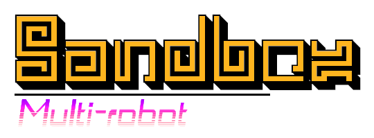

<p align="center">
  
</p>

# [Table of Contents](#table-of-contents)

- [Motivation](docs/motivation.md)
- [Setup](docs/working_environment.md)
- [Usage](docs/usage.md)
- [Robots](docs/robots.md)
- [Contributing](docs/contributing.md)

## [ROS-Jazzy-Multi-robot-Sandbox](#ros-jazzy-multi-robot-sandbox)

This workspace is a sandbox for multi-robot research.

Initially, it includes a stack for ROS 2 Jazzy Jalisco and Ubuntu 24.04 that facilitates working with multiple robots in Ignition Gazebo. It provides an environment for heterogeneous robots, UAVs, and UGVs, publishing the correct transformation trees and topics to control mobile robots out-of-the-box. It can help you advance your research or development more quickly without needing prior knowledge to configure simulations within the ROS 2 environment, including operational systems, computer networks, parallel computing, simulation architectures, linear algebra, and more.

## [What to Expect?](#what-to-expect)

### UGVs and UAV from Fuel already configured to work with ROS Jazzy in Ubuntu 24.04 and Ignition Gazebo to accelerate your work or research.

<p align="center">
  
</p>

### Parameterized namespaces through python launch files for correct transform trees and integration with ```gazebo_ros_bridge```.

<p align="center">
  
</p>

### Out-of-the-box for you ROS 2 Jazzy environment for ```Multi-robot applications``` and a seamless integration with visualization softwares like RViz2 to further accelerate your development.

## [Packages](#packages)

- [multi-robot-simulations](docs/multi-robot-simulations.md)

## [Features Roadmap](#features-roadmap)

| Feature | Status |
|-|-|
| Enhance Documentation | <span style="color:green">in-progress</span> |
| [ROS Adapt Algorithms From ROS 1 Noetic](https://github.com/Ophien/ROS-Noetic-Multi-robot-Sandbox) | <span style="color:green">in-progress</span> |
| [Add Real World Deployment](https://youtu.be/8FP3UK7kpRA?feature=shared) | |
| Youtube Channel | |
| Add Robust Testing | |
| Add Probabilistic-based Global Planner | |
| Add Pose Graph-base Mapping | |
| Add Pose Graph Merging | |
| Add Heterogeneous Robot Teams Support | |
| Add Human Computer Interfaces for Ground Teams | |
| Add Mission Assignment and Inspector | |
| Add Other Baselines and Algorithms | |
| Add Other Coordination Methods | |
| [Add More Realistic Maps and Environments for Fuel](https://app.gazebosim.org/fuel/models) | |
| [Add Safety Mechanisms for Navigation and Traffic Avoidance](https://youtu.be/HSFmGdI0TAY?si=gvVgttymSCMpddl7) | |
| Unity3D integration | |

## [Support this Project](#support-this-project)

Support Open Source mobile robots projects for search and rescue in natural disasters, which is my main motivation. Your donation will make a huge difference!

[](https://www.paypal.com/donate/?business=YWAAG5LVWXBQC&no_recurring=0&item_name=Support+Open+Source+mobile+robots+projects+for+search+and+rescue+in+natural+disasters.+Your+donation+can+change+lives%21&currency_code=USD)
[](https://www.paypal.com/donate/?business=YWAAG5LVWXBQC&no_recurring=0&item_name=Support+Open+Source+mobile+robots+projects+for+search+and+rescue+in+natural+disasters.+Your+donation+can+change+lives%21&currency_code=BRL)

## [License](#license)

All content from this repository is released under a modified [BSD 4-clause license](LICENSE).

Author/Maintainer:

- [Alysson Ribeiro da Silva](https://alysson.thegeneralsolution.com/)

emails:

- <alysson.ribeiro.silva@gmail.com>

## [Bug & Feature Requests](#bug--feature-requests)

Please report bugs and do your requests to add new features through the [Issue Tracker](https://github.com/multirobotplayground/Multi-robot-Intermittent-Rendezvous/issues).
