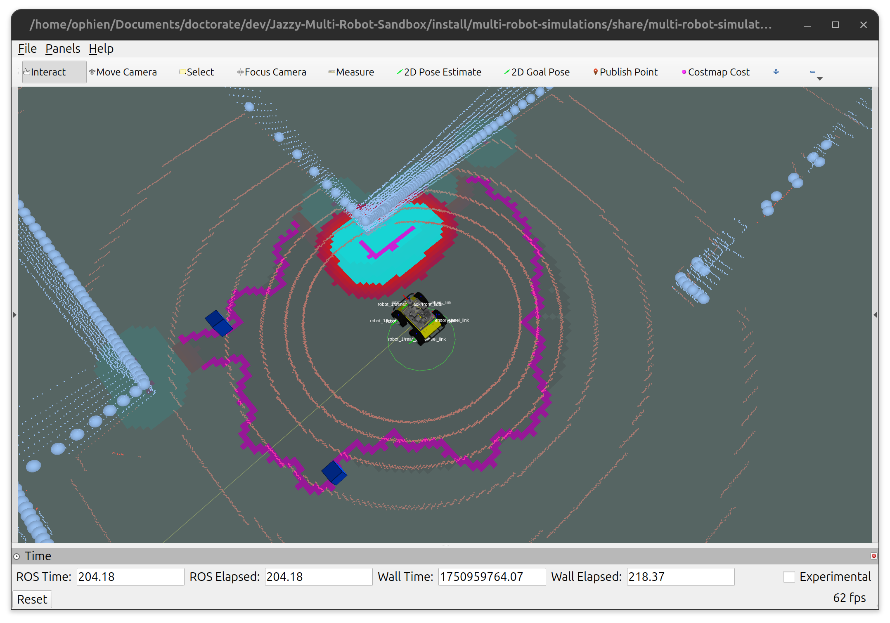
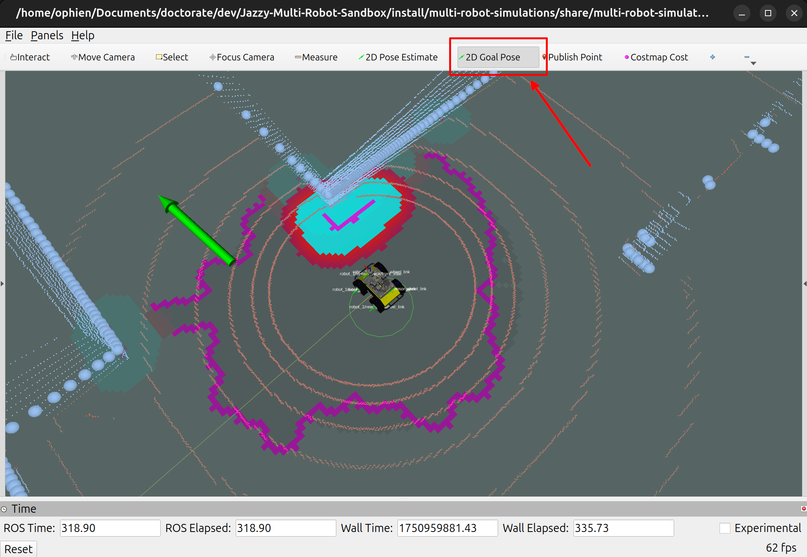
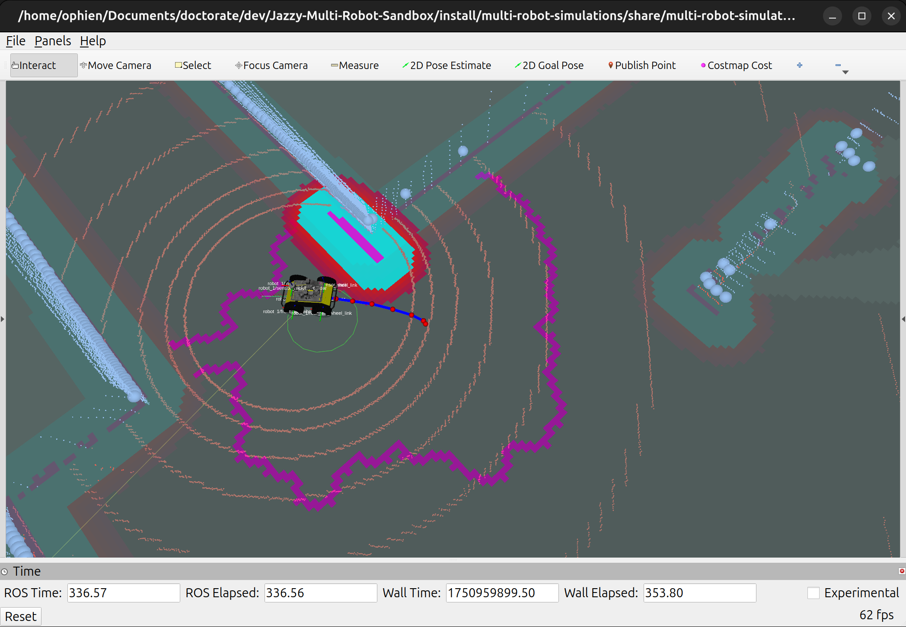
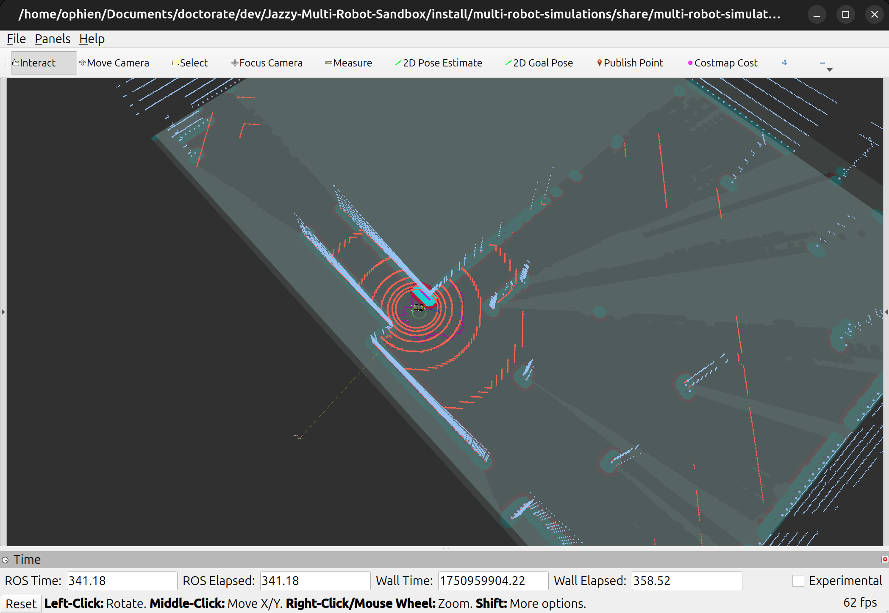
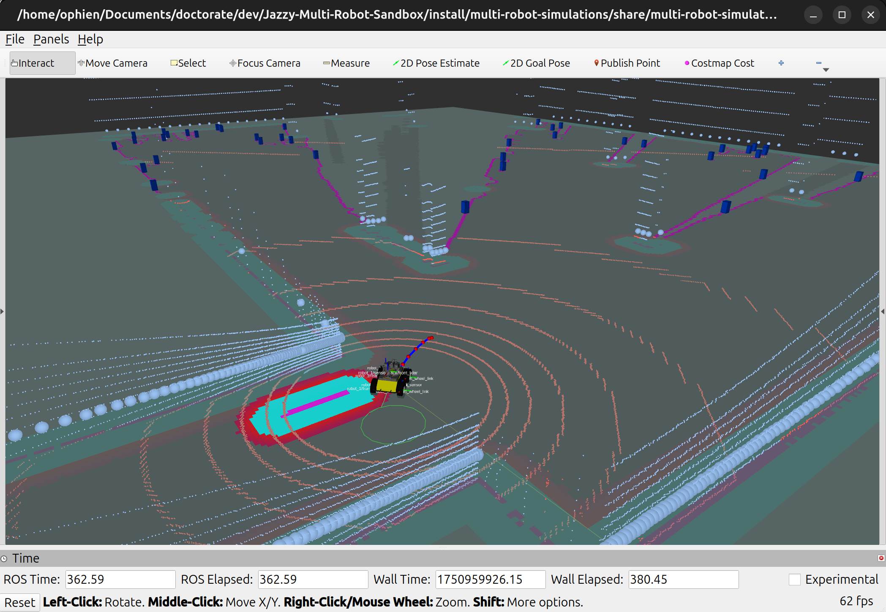

## Table of Contents

- [Frontier Discovery Demonstration](#frontier-discovery-demonstration)
  - [Setup](#setup)
    - [Repository Setup Instructions](#repository-setup-instructions)
  - [Classic Frontier Discovery](#classic-frontier-discovery)
  - [Support this Project](#support-this-project)
  - [License](#license)

# [Frontier Discovery Demonstration](#frontier-discovery-demonstration)

This demonstration showcases how to:

- Call the frontier discovery service to generate clusters or center of masses with a classic frontier exploration method
- Send goals to the robot in RViz2 and generate new frontiers from the updated map
- Provide insights on how this is integrated with Nav2 and the SlamToolbox

## [Setup](#setup)

Before running the demonstrations, follow the instructions in our [setup guide](docs/working_environment.md) to properly configure your environment.

### [Repository Setup Instructions](#repository-setup-instructions)

Once your environment is ready, follow these steps to set up the project:

1. **Clone the repository:**  
  Download the project files to your computer.
  ```bash
  git clone https://github.com/multirobotplayground/Jazzy-Multi-Robot-Sandbox.git
  cd Jazzy-Multi-Robot-Sandbox
  ```

2. **Initialize submodules:**  
  Some dependencies are included as submodules. This command fetches them.
  ```bash
  git submodule update --init --remote
  ```

3. **Source ROS 2 environment:**  
  Make sure your terminal session is using the correct ROS 2 distribution (here, `jazzy`).
  ```bash
  source /opt/ros/jazzy/setup.bash
  ```

4. **Build the workspace:**  
  Compile all packages in the repository.
  ```bash
  colcon build
  ```

5. **Source the workspace:**  
  Update your environment so ROS 2 can find the newly built packages.
  ```bash
  source install/setup.bash
  ```

After completing these steps, your workspace will be ready to run the multi-robot simulations and integrations described in this guide.

## [Classic Frontier Discovery](#classic-frontier-discovery)

- Run the simulation through the [frontier_discovery_launch.py](../../../src/multi-robot-simulations/launch/integrations/frontier_discovery/frontier_discovery_launch.py) launch file. It is going to spawn a Husky robot with Nav2, slam-toolbox, and a frontier discovery node.

  - If everything runs correctly, you should see the following scene.

<p align='center'>
    
</p>

- Call the frontier discovery service

```
ros2 service call /robot_1/frontier_clusters_discovery/compute frontier_msgs/srv/Frontiers
```

 - The system will compute the frontier cells, clusters, and center of masses. This process is done this way due to performance issues if compared to others that iterate over the map cells with quadratic complexity.
 - If the service run appropriately, you should see the following on RViz2.
 - The magenta lines represent frontier cells, whereas the blue boxes are the frontier center of masses from two different cell clusters.

<p align='center'>
    
</p>

- Set a Nav2 goal in the following RViz2 button. 

<p align='center'>
    
</p>

  - The robot must navigate towards the location, avoiding obstacles, and uncovering new areas of the warehouse as follows.

<p align='center'>
    
    
</p>

- Call the frontier discovery service again to discover new center of masses.

```
ros2 service call /robot_1/frontier_clusters_discovery/compute frontier_msgs/srv/Frontiers
```

  - You should see the new frontiers and their centroids as follows.

<p align='center'>
    
    
</p>

## [Support this Project](#support-this-project)

Support Open Source mobile robots projects for search and rescue in natural disasters, which is my main motivation. Your donation will make a huge difference!

[](https://www.paypal.com/donate/?business=YWAAG5LVWXBQC&no_recurring=0&item_name=Support+Open+Source+mobile+robots+projects+for+search+and+rescue+in+natural+disasters.+Your+donation+can+change+lives%21&currency_code=USD)
[](https://www.paypal.com/donate/?business=YWAAG5LVWXBQC&no_recurring=0&item_name=Support+Open+Source+mobile+robots+projects+for+search+and+rescue+in+natural+disasters.+Your+donation+can+change+lives%21&currency_code=BRL)

## [License](#license)

All content from this repository is released under a modified [GPLv3 license](LICENSE).

Author/Maintainer:

- [Alysson Ribeiro da Silva](https://alysson.thegeneralsolution.com/)

emails:

- <alysson.ribeiro.silva@gmail.com>