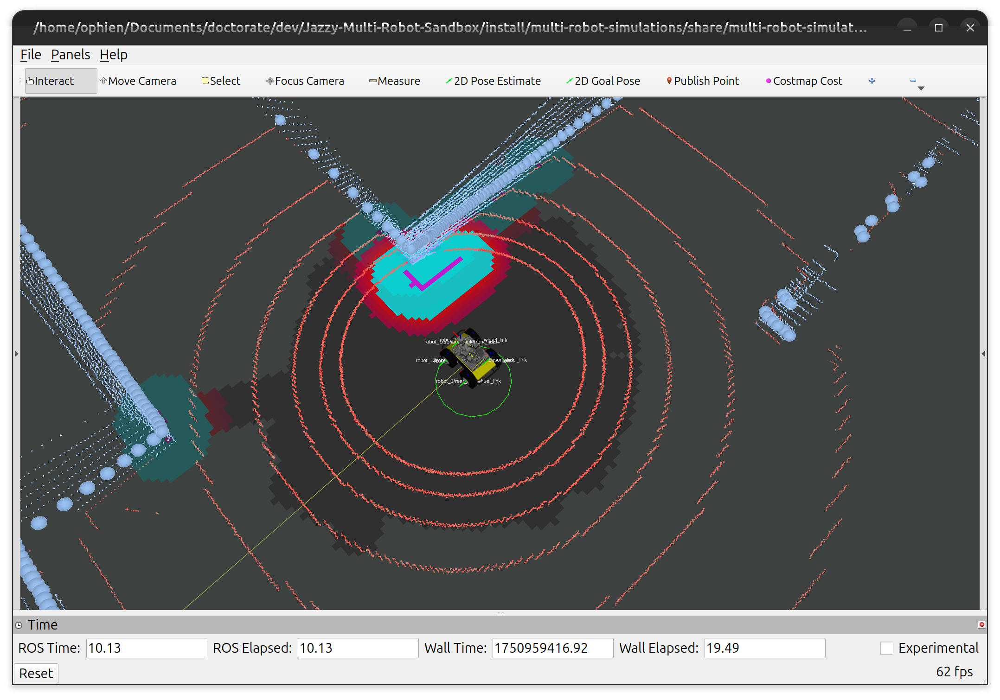

## Table of Contents

- [Frontier Exploration Demonstration](#frontier-exploration-demonstration)
  - [Setup](#setup)
    - [Repository Setup Instructions](#repository-setup-instructions)
  - [Frontier Exploration with Random Selection](#frontier-exploration-with-random-selection)
  - [Support this Project](#support-this-project)
  - [License](#license)

# [Frontier Exploration Demonstration](#frontier-discovery-demonstration)

This demonstration showcases how to:

- Call the frontier exploration service to start an exploration mission
- The robot will use the frontier discovery service alongside the exploration algorithm and fully explore the reachable areas of the warehouse
- Frontiers are selected randomly, which is the most simple selection baseline

## [Setup](#setup)

Before running the demonstrations, follow the instructions in our [setup guide](docs/working_environment.md) to properly configure your environment.

### [Repository Setup Instructions](#repository-setup-instructions)

Once your environment is ready, follow these steps to set up the project:

1. **Clone the repository:**  
  Download the project files to your computer.
  ```bash
  git clone https://github.com/multirobotplayground/Jazzy-Multi-Robot-Sandbox.git
  cd Jazzy-Multi-Robot-Sandbox
  ```

2. **Initialize submodules:**  
  Some dependencies are included as submodules. This command fetches them.
  ```bash
  git submodule update --init --remote
  ```

3. **Source ROS 2 environment:**  
  Make sure your terminal session is using the correct ROS 2 distribution (here, `jazzy`).
  ```bash
  source /opt/ros/jazzy/setup.bash
  ```

4. **Build the workspace:**  
  Compile all packages in the repository.
  ```bash
  colcon build
  ```

5. **Source the workspace:**  
  Update your environment so ROS 2 can find the newly built packages.
  ```bash
  source install/setup.bash
  ```

After completing these steps, your workspace will be ready to run the multi-robot simulations and integrations described in this guide.

## [Frontier Exploration with Random Selection](#classic-frontier-discovery)

- Run the simulation through the [frontier_exploration_launch.py](../../../src/multi-robot-simulations/launch/integrations/frontier_exploration/frontier_exploration_launch.py) launch file. It is going to spawn a Husky robot with Nav2, slam-toolbox, and a frontier discovery node.

  - If everything runs correctly, you should see the following scene.

<p align='center'>
    
</p>

- Call the frontier exploration service and start the mission

```
ros2 service call /robot_1/frontier_exploration/start_mission
```

 - The system will compute the frontier cells, clusters, and center of masses. This process is done this way due to performance issues if compared to others that iterate over the map cells with quadratic complexity.
 - The robot should start its behavior tree action regarding frontier exploration [ExploreFrontierAction.cpp](../../../src/exploration_tools/frontier_exploration/src/ExploreFrontierAction.cpp)
   - The frontier tree in this demonstration has only one action
 - Next, it will select a random frontier, navigate towards it with the Nav2 stack, and update the pose graph with the Slam Toolbox
 - See the video bellow on what to expect

<p align="center">
  <a href="https://www.youtube.com/watch?v=xDW_arUw8jo" target="_blank">
    
  </a>
</p>

## [Support this Project](#support-this-project)

Support Open Source mobile robots projects for search and rescue in natural disasters, which is my main motivation. Your donation will make a huge difference!

[](https://www.paypal.com/donate/?business=YWAAG5LVWXBQC&no_recurring=0&item_name=Support+Open+Source+mobile+robots+projects+for+search+and+rescue+in+natural+disasters.+Your+donation+can+change+lives%21&currency_code=USD)
[](https://www.paypal.com/donate/?business=YWAAG5LVWXBQC&no_recurring=0&item_name=Support+Open+Source+mobile+robots+projects+for+search+and+rescue+in+natural+disasters.+Your+donation+can+change+lives%21&currency_code=BRL)

## [License](#license)

All content from this repository is released under a modified [GPLv3 license](LICENSE).

Author/Maintainer:

- [Alysson Ribeiro da Silva](https://alysson.thegeneralsolution.com/)

emails:

- <alysson.ribeiro.silva@gmail.com>