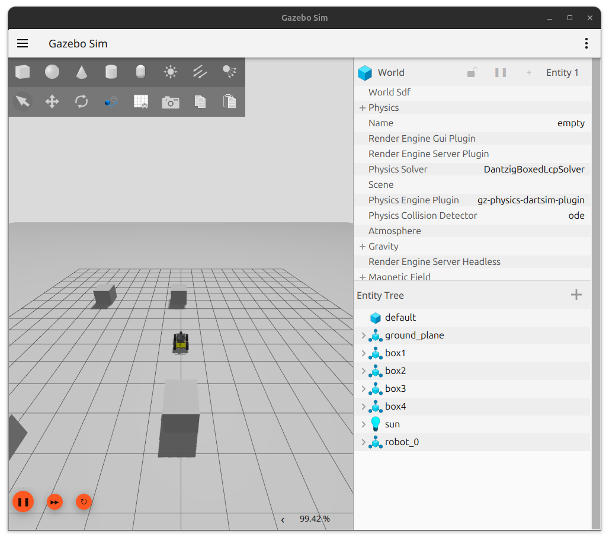
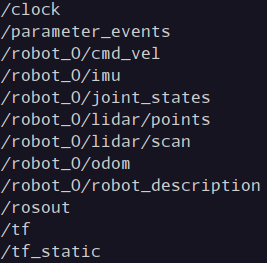
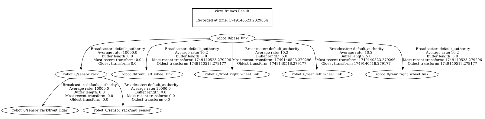

## Table of Contents

- [Ignition Simulator Demonstration](#ignition-simulator-demonstration)
  - [Setup](#setup)
    - [Repository Setup Instructions](#repository-setup-instructions)
  - [Namespacing with Configuration File](#namespacing-with-configuration-file)
  - [Namespacing without a Configuration File](#namespacing-without-a-configuration-file)
  - [Checking the Topics and Transforms](#checking-the-topics-and-transforms)
  - [Support this Project](#support-this-project)
  - [License](#license)

# [Ignition Simulator Demonstration](#ignition-simulator-demonstration)

The purpose of this demonstration is to show how:

- The configuration file [gz_bridge.yaml](../../../src/multi-robot-simulations/config/integrations/gz_ignition_bridge/gz_bridge.yaml) is used help setting the namespace of a robot with [ros_gz_bridge](https://index.ros.org/p/ros_gz_bridge/).
- How to configure the bridge directly in the launch file [gz_bridge_no_config_file_launch.py](../../../src/multi-robot-simulations/launch/integrations/gz_ignition_bridge/gz_bridge_no_config_file_launch.py).

## [Setup](#setup)

Follow the steps described in our [setup](docs/working_environment.md) tutorial to configure your machine before running these demonstrations.

### [Repository Setup Instructions](#repository-setup-instructions)

Once your environment is ready, follow these steps to set up the project:

1. **Clone the repository:**  
  Download the project files to your computer.
  ```bash
  git clone https://github.com/multirobotplayground/Jazzy-Multi-Robot-Sandbox.git
  cd Jazzy-Multi-Robot-Sandbox
  ```

2. **Initialize submodules:**  
  Some dependencies are included as submodules. This command fetches them.
  ```bash
  git submodule update --init --remote
  ```

3. **Source ROS 2 environment:**  
  Make sure your terminal session is using the correct ROS 2 distribution (here, `jazzy`).
  ```bash
  source /opt/ros/jazzy/setup.bash
  ```

4. **Build the workspace:**  
  Compile all packages in the repository.
  ```bash
  colcon build
  ```

5. **Source the workspace:**  
  Update your environment so ROS 2 can find the newly built packages.
  ```bash
  source install/setup.bash
  ```

After completing these steps, your workspace will be ready to run the multi-robot simulations and integrations described in this guide.

## [Namespacing with Configuration File](#namespacing-with-configuration-file)

- Run the [gz_bridge_config_file_launch.py](../../../src/multi-robot-simulations/launch/integrations/gz_ignition_bridge/gz_bridge_config_file_launch.py) launch file from the [multi-robot-simulations](../../../src/multi-robot-simulations) package.

    ```
    ros2 launch multi-robot-simulations gz_bridge_config_file_launch.py
    ```

    If everything run correctly, ignition should open as follows:

    <p align="center">
    
    </p>

## [Namespacing without a Configuration File](#namespacing-without-a-configuration-file)

Run the [gz_bridge_no_config_file_launch.py](../../../src/multi-robot-simulations/launch/integrations/gz_ignition_bridge/gz_bridge_no_config_file_launch.py) launch file from the [multi-robot-simulations](../../../src/multi-robot-simulations) package.

```
ros2 launch multi-robot-simulations gz_bridge_no_config_file_launch.py
```

## [Checking the Topics and Transforms](#checking-the-topics-and-transforms)

- Run the following to see the available topics:

    ```
    ros2 topic list
    ```

    The topics bellow are available for this demonstration, all under the namespace `robot_0`.

    <p align="center">
    
    </p>

- Check the transformation tree

    ```
    ros2 run tf2_tools view_frames
    ```

    This command will generate a pdf file showing the current transformation tree of the demo robot.

    <p align="center">
    
    </p>
   
## [Support this Project](#support-this-project)

Support Open Source mobile robots projects for search and rescue in natural disasters, which is my main motivation. Your donation will make a huge difference!

[](https://www.paypal.com/donate/?business=YWAAG5LVWXBQC&no_recurring=0&item_name=Support+Open+Source+mobile+robots+projects+for+search+and+rescue+in+natural+disasters.+Your+donation+can+change+lives%21&currency_code=USD)
[](https://www.paypal.com/donate/?business=YWAAG5LVWXBQC&no_recurring=0&item_name=Support+Open+Source+mobile+robots+projects+for+search+and+rescue+in+natural+disasters.+Your+donation+can+change+lives%21&currency_code=BRL)

## [License](#license)

All content from this repository is released under a modified [GPLv3 license](LICENSE).

Author/Maintainer:

- [Alysson Ribeiro da Silva](https://alysson.thegeneralsolution.com/)

emails:

- <alysson.ribeiro.silva@gmail.com>