## Table of Contents

- [Heterogeneous Team and Namespacing Demonstration](#heterogeneous-team-and-namespacing-demonstration)
  - [Setup](#setup)
    - [Repository Setup Instructions](#repository-setup-instructions)
  - [Heterogeneous Teams](#heterogeneous-teams)
  - [Checking ROS Topics and Transforms](#checking-ros-topics-and-transforms)
    - [Available Topics](#available-topics)
    - [Visualizing TF Tree](#visualizing-tf-tree)
  - [Available Robots](#available-robots)
    - [Clearpath Husky](#clearpath-husky)
    - [X2 UGV](#x2-ugv)
    - [X4 UAV](#x4-uav)
  - [Support this Project](#support-this-project)
  - [License](#license)

# [Heterogeneous Team and Namespacing Demonstration](#heterogeneous-team-and-namespacing-demonstration)

This demonstration showcases how to:

- Configure and operate a heterogeneous team of robots in Ignition Gazebo using customized spawn launch files:
  - [Husky UGV](../../../src/multi-robot-simulations/launch/integrations/heterogeneous_teams/heterogeneous_spawn_husky_ugv_launch.py)
  - [X2 UGV](../../../src/multi-robot-simulations/launch/integrations/heterogeneous_teams/heterogeneous_spawn_x2_ugv_launch.py)
  - [X4 UAV](../../../src/multi-robot-simulations/launch/integrations/heterogeneous_teams/heterogeneous_spawn_x4_ufv_launch.py)
- Launch and remap multiple RViz2 instances, each with its own configuration file for development and visualization

## [Setup](#setup)

Before running the demonstrations, follow the instructions in our [setup guide](docs/working_environment.md) to properly configure your environment.

### [Repository Setup Instructions](#repository-setup-instructions)

Once your environment is ready, follow these steps to set up the project:

1. **Clone the repository:**  
  Download the project files to your computer.
  ```bash
  git clone https://github.com/multirobotplayground/Jazzy-Multi-Robot-Sandbox.git
  cd Jazzy-Multi-Robot-Sandbox
  ```

2. **Initialize submodules:**  
  Some dependencies are included as submodules. This command fetches them.
  ```bash
  git submodule update --init --remote
  ```

3. **Source ROS 2 environment:**  
  Make sure your terminal session is using the correct ROS 2 distribution (here, `jazzy`).
  ```bash
  source /opt/ros/jazzy/setup.bash
  ```

4. **Build the workspace:**  
  Compile all packages in the repository.
  ```bash
  colcon build
  ```

5. **Source the workspace:**  
  Update your environment so ROS 2 can find the newly built packages.
  ```bash
  source install/setup.bash
  ```

After completing these steps, your workspace will be ready to run the multi-robot simulations and integrations described in this guide.

## [Heterogeneous Teams](#heterogeneous-teams)

Run the following launch file from the `multi-robot-simulations` package:

```
ros2 launch multi-robot-simulations heterogeneous_launch.py
```

If the launch is successful, Ignition Gazebo should start alongside six RViz2 instances, each dedicated to a different robot:

<p align="center">
  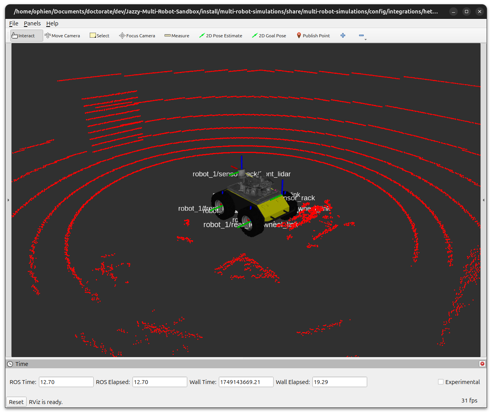
  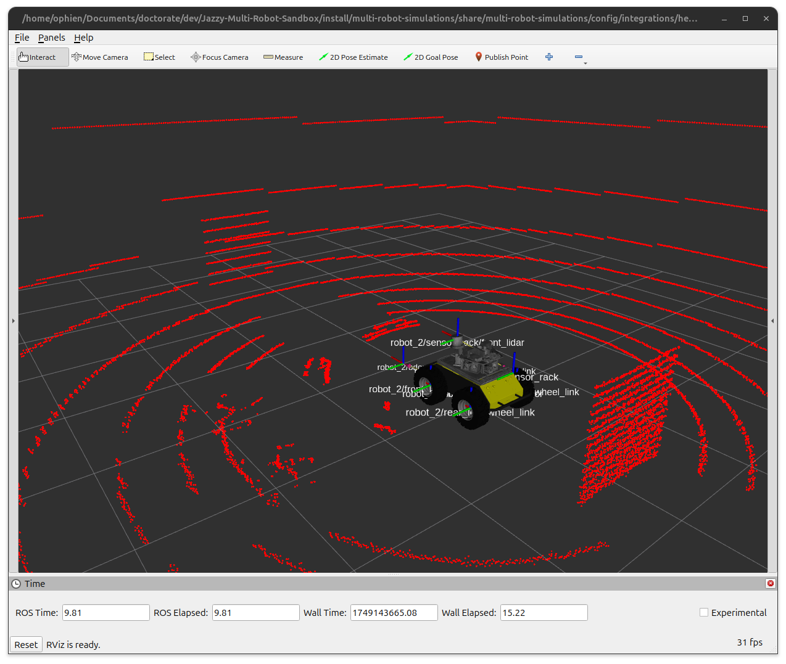
</p>
<p align="center">
  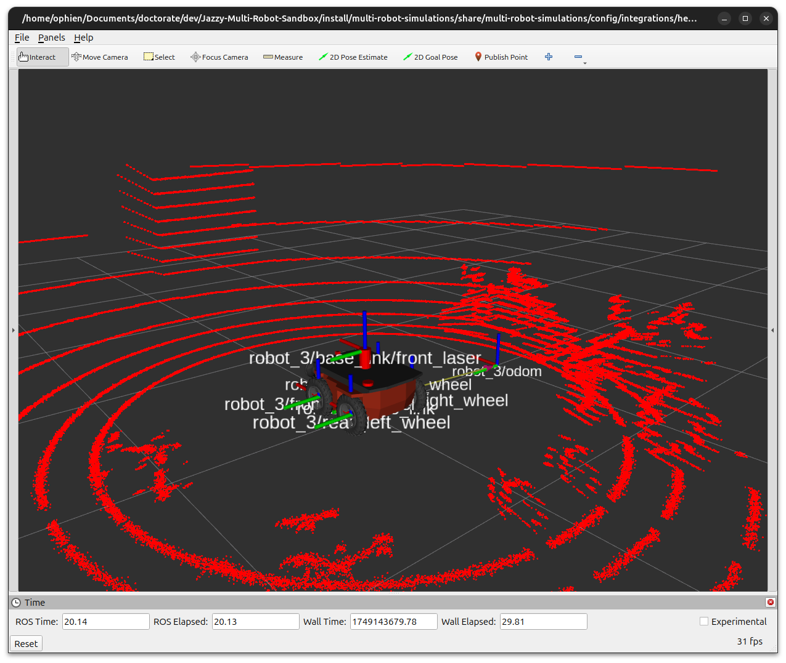
  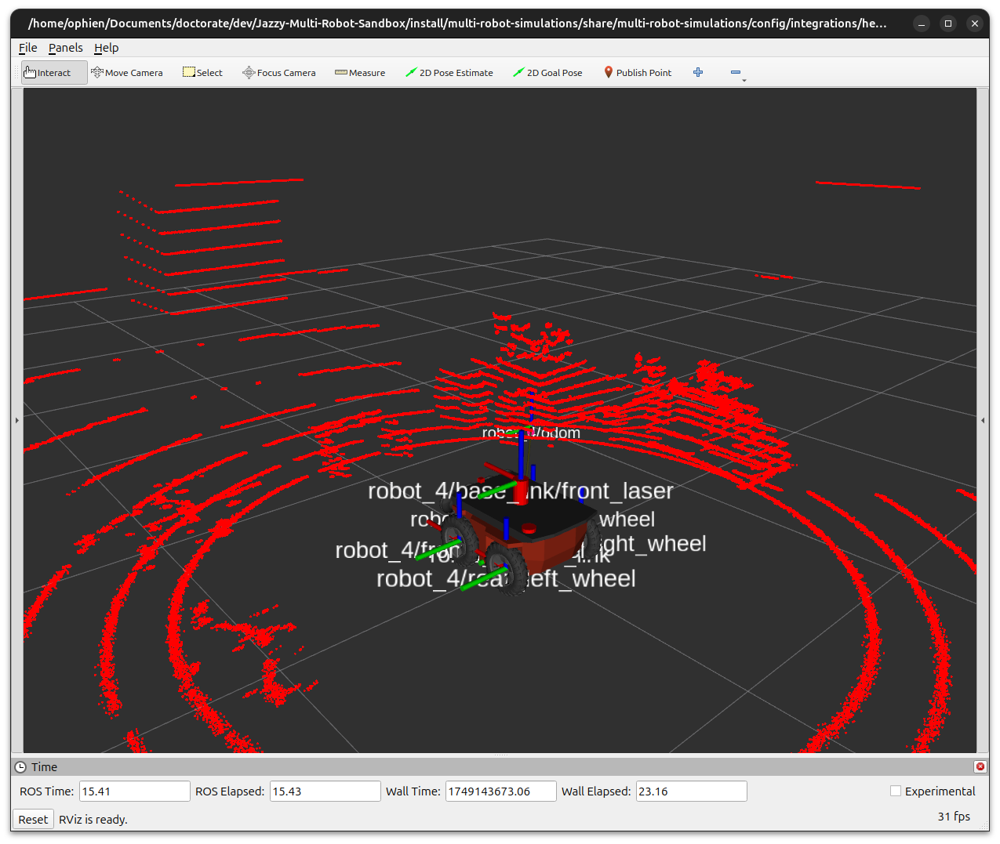
</p>
<p align="center">
  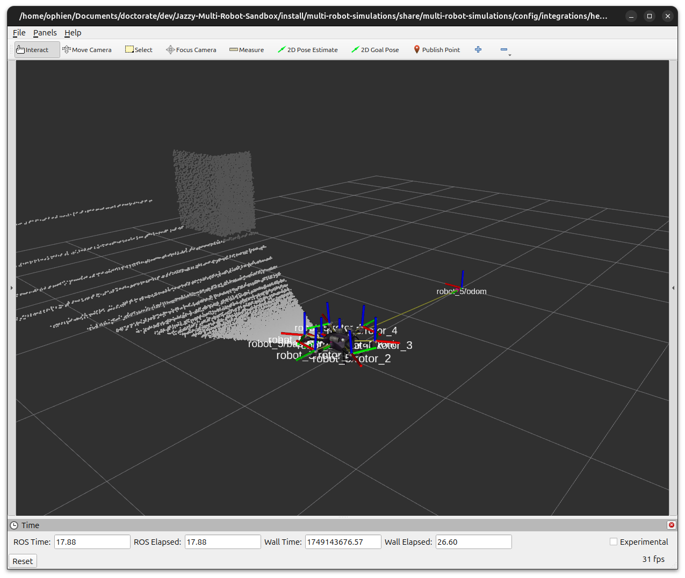
  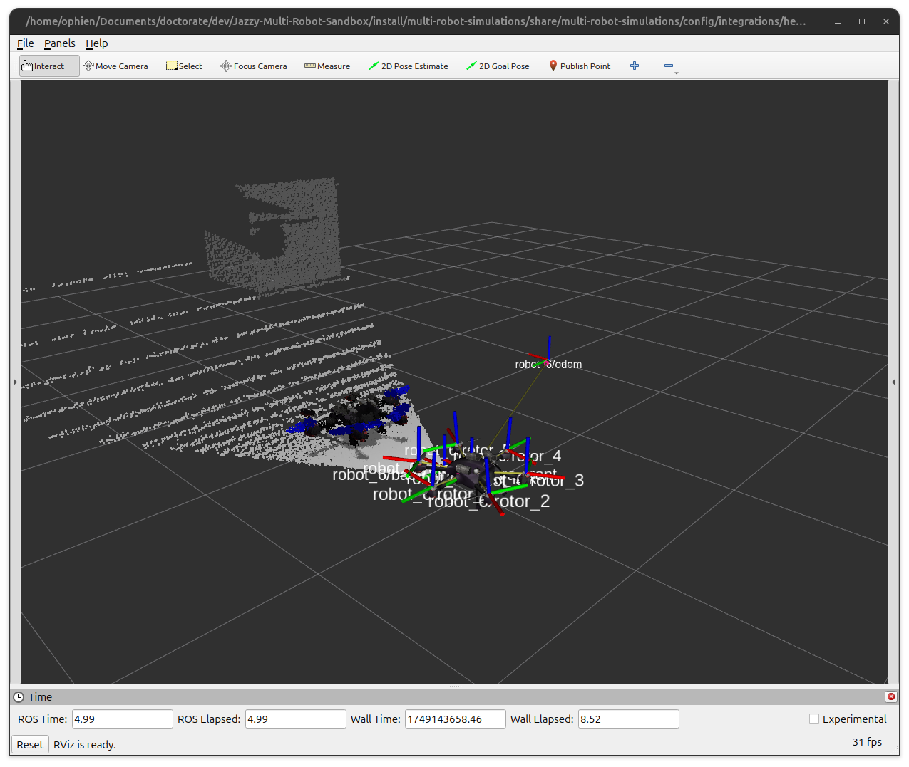
</p>

## [Checking ROS Topics and Transforms](#checking-ros-topics-and-transforms)

### [Available Topics](#available-topics)

Run the following command:

```
ros2 topic list
```

You should see topics for all robots, such as:

```
/clock
/parameter_events
/robot_1/cmd_vel
/robot_1/imu
/robot_1/joint_states
/robot_1/lidar/points
/robot_1/lidar/scan
/robot_1/odometry
/robot_1/pose
/robot_1/robot_description
...
/robot_6/pose
/robot_6/robot_description
/rosout
/tf
/tf_static
```

### [Visualizing TF Tree](#visualizing-tf-tree)

To visualize the transformation tree:

```
ros2 run tf2_tools view_frames
```

This will generate a `.pdf` file with a full-frame diagram of your robot transforms.

## [Available Robots](#available-robots)

- [Clearpath Husky](#clearpath-husky)
- [X2 UGV](#x2-ugv)
- [X4 UAV](#x4-uav)

### [Clearpath Husky](#clearpath-husky)

**Sensors and data:**

- IMU  
- 3D LiDAR  
- 2D LiDAR  
- Odometry  
- Ground truth pose  

<p align="center">
  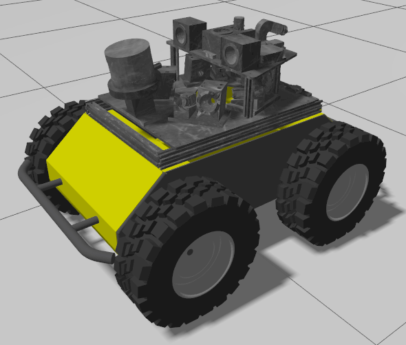
</p>

**TF Tree:**

<p align="center">
  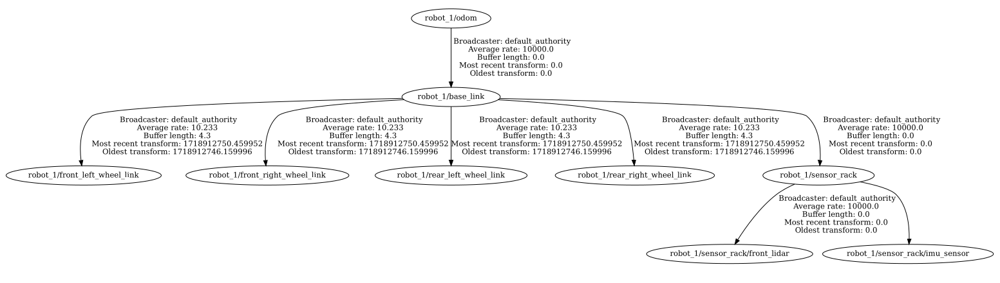
</p>

**RViz Visualization:**

<p align="center">
  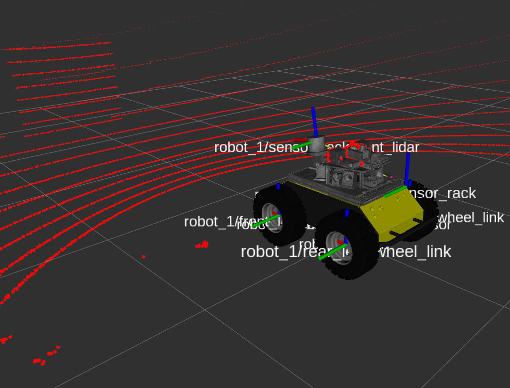
</p>

### [X2 UGV](#x2-ugv)

**Sensors and data:**

- IMU  
- 3D LiDAR  
- 2D LiDAR  
- Odometry  
- Ground truth pose  

<p align="center">
  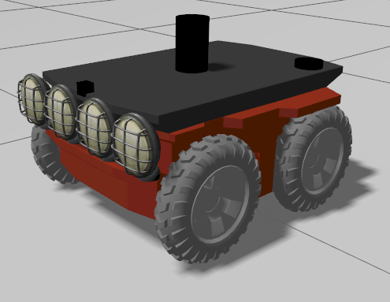
</p>

**TF Tree:**

<p align="center">
  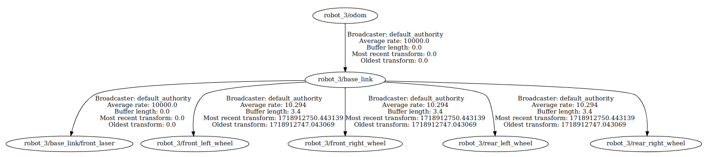
</p>

**RViz Visualization:**

<p align="center">
  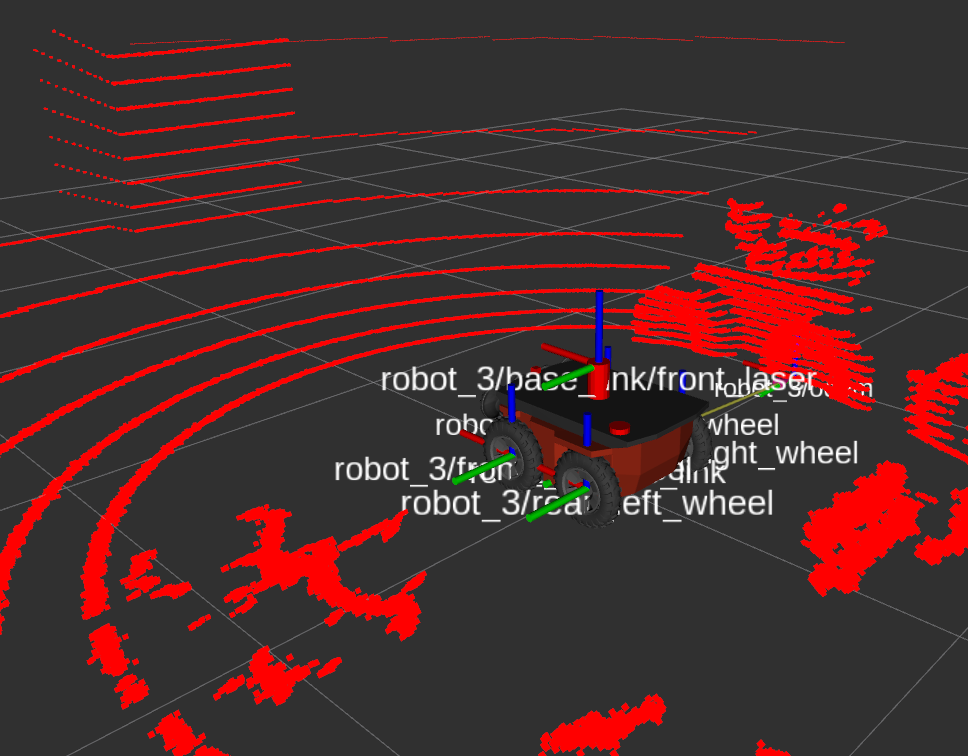
</p>

### [X4 UAV](#x4-uav)

**Sensors and data:**

- IMU  
- RGB-D Camera  
- Odometry  
- Ground truth pose  

<p align="center">
  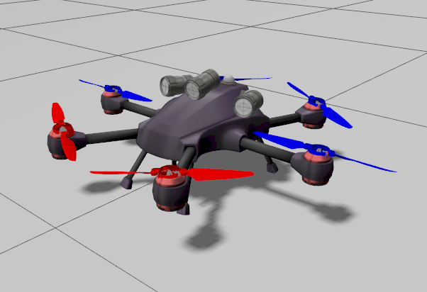
</p>

**TF Tree:**

<p align="center">
  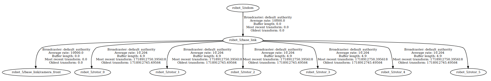
</p>

**RViz Visualization:**

<p align="center">
  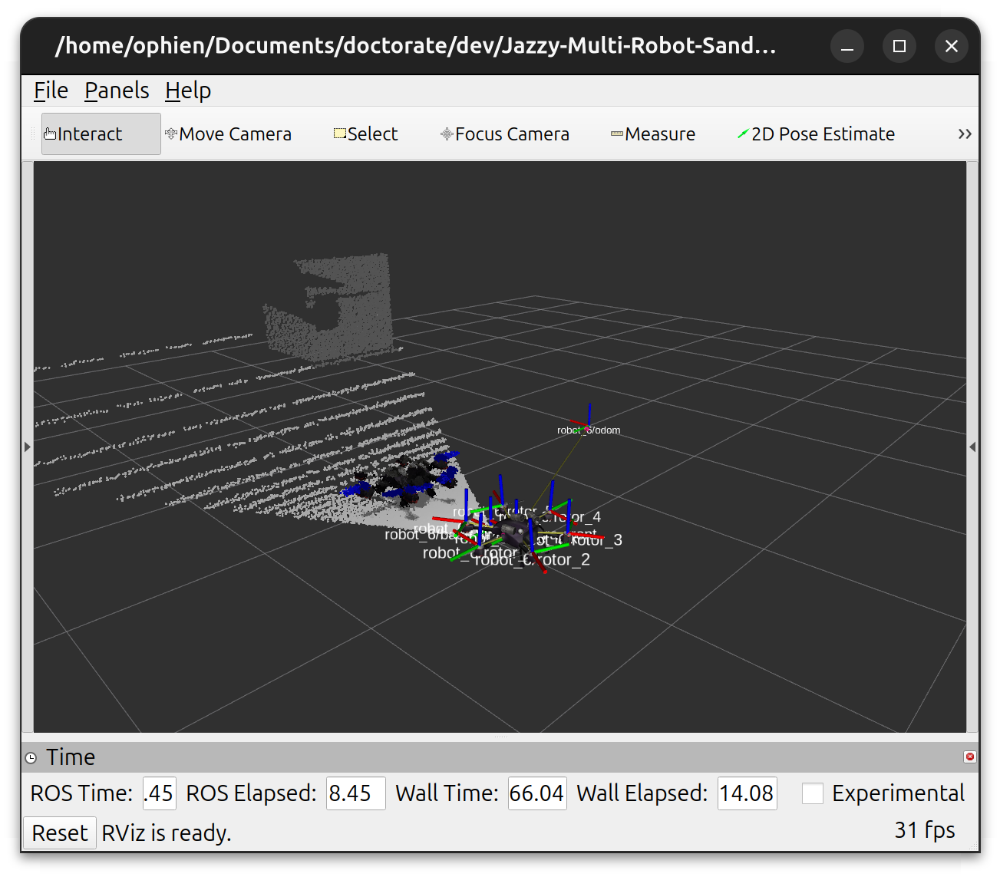
</p>

## [Support this Project](#support-this-project)

Support Open Source mobile robots projects for search and rescue in natural disasters, which is my main motivation. Your donation will make a huge difference!

[](https://www.paypal.com/donate/?business=YWAAG5LVWXBQC&no_recurring=0&item_name=Support+Open+Source+mobile+robots+projects+for+search+and+rescue+in+natural+disasters.+Your+donation+can+change+lives%21&currency_code=USD)
[](https://www.paypal.com/donate/?business=YWAAG5LVWXBQC&no_recurring=0&item_name=Support+Open+Source+mobile+robots+projects+for+search+and+rescue+in+natural+disasters.+Your+donation+can+change+lives%21&currency_code=BRL)

## [License](#license)

All content from this repository is released under a modified [GPLv3 license](LICENSE).

Author/Maintainer:

- [Alysson Ribeiro da Silva](https://alysson.thegeneralsolution.com/)

emails:

- <alysson.ribeiro.silva@gmail.com>