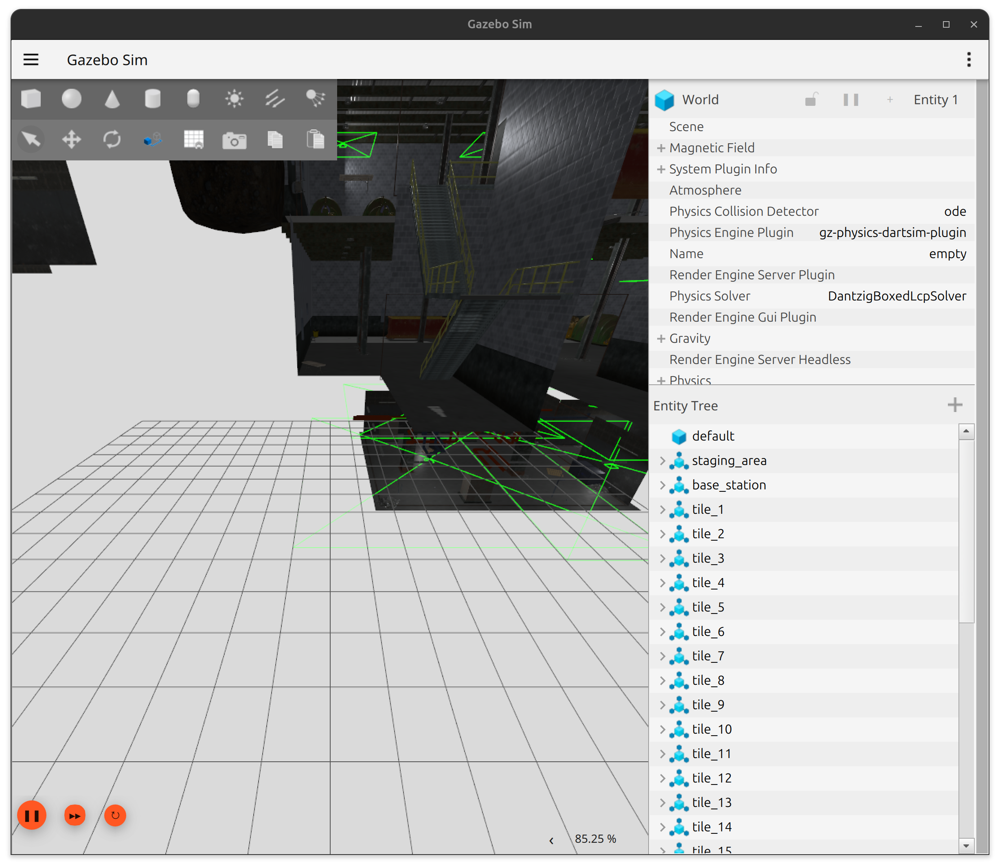
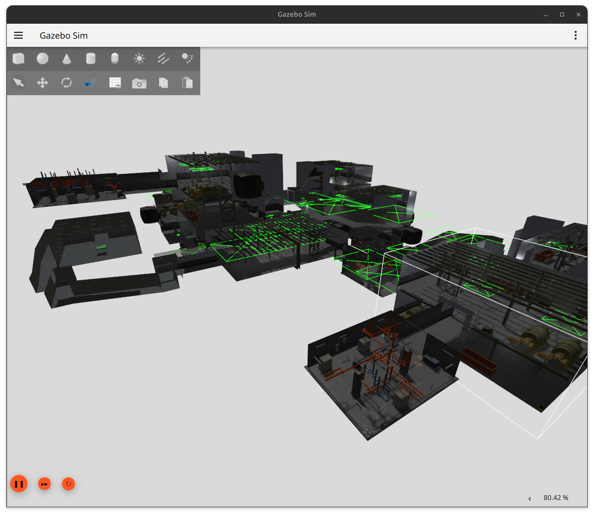
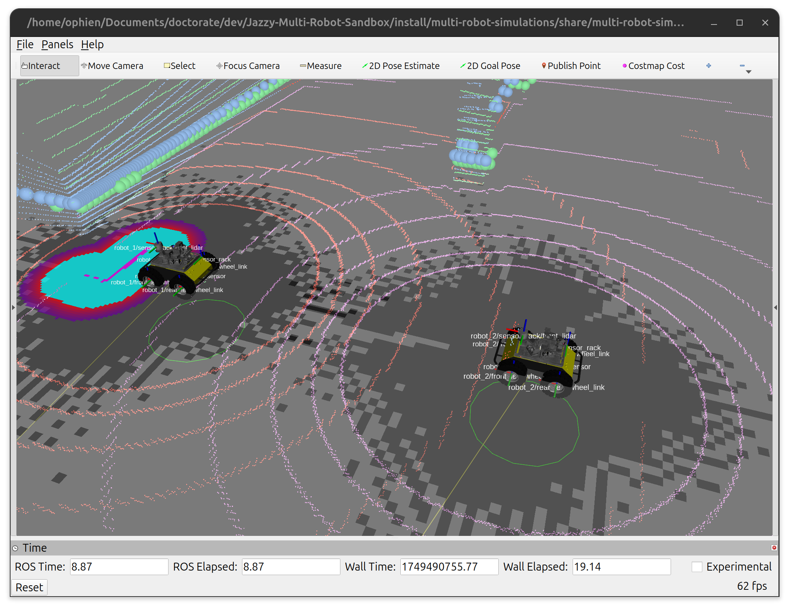
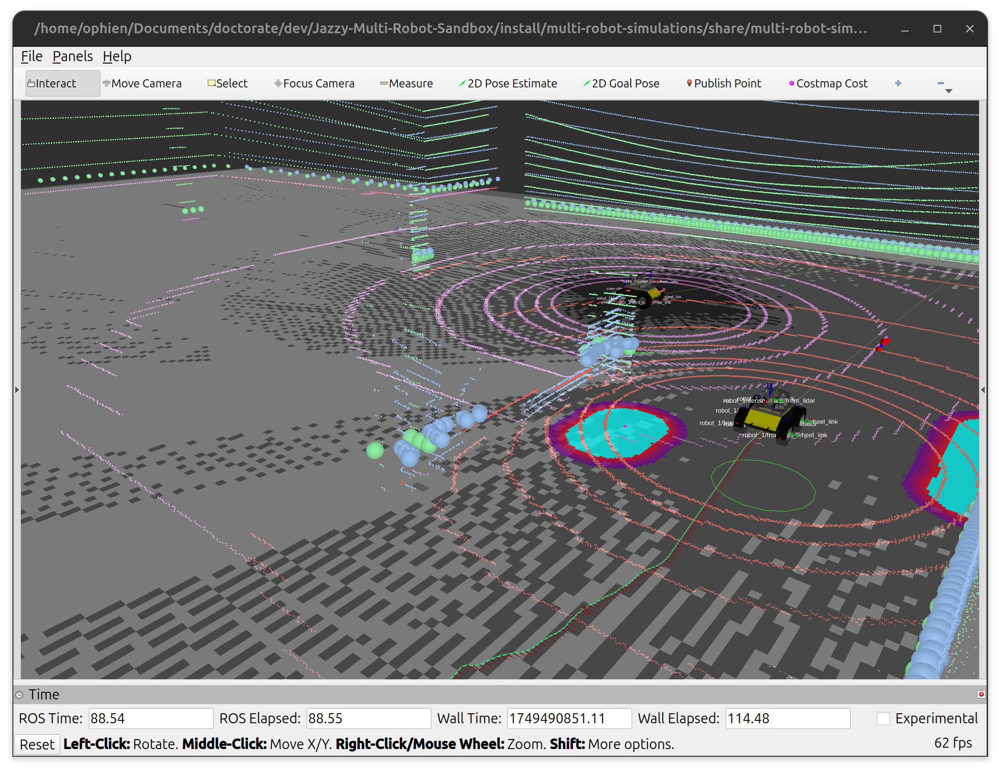

## Table of Contents
- [Multi-robot Slam Toolbox and Nav2 Integration](#multi-robot-slam-toolbox-and-nav2-integration)
- [Setup](#setup)
- [Slam-Toolbox and Nav2 Integration](#slam-toolbox-and-nav2-integration)
- [ROS Nav 2](#ros-nav-2)
- [Slam Toolbox](#slam-toolbox)
- [Joystick Teleoperation](#joystick-teleoperation)
  - [Support this Project](#support-this-project)
  - [License](#license)

# [Multi-robot Slam Toolbox and Nav2 Integration](#multi-robot-slam-toolbox-and-nav2-integration)

This guide demonstrates how to integrate Slam Toolbox and Nav2 for multi-robot simulations using Husky robots in Gazebo and RViz. You'll learn how to launch the simulation, configure navigation and SLAM for multiple robots, and teleoperate them using a joystick.

# [Setup](#setup)

Before running the demonstrations, follow the instructions in our [setup guide](docs/working_environment.md) to properly configure your environment.

# [Slam-Toolbox and Nav2 Integration](#slam-toolbox-and-nav2-integration)

Run the following launch file from the `multi-robot-simulations` package:

```
ros2 launch multi-robot-simulations toolbox_nav2_multi_husky.py
```

If the simulations run accordingly, you should see the following Gazebo Ignition scene. Play around with it!

<p align="center">
    
    
</p>

Also, RViz must open a multi-robot configuration file, where both Husky robots are configured in the same scene, highlighting their sensors.

<p align="center">
    
</p>

<p align="center">
    
    
</p>

# [ROS Nav 2](#ros-nav-2)

The [Nav2](https://docs.nav2.org/) package is configured in both robots from the scene. There is one file for each robot, because ROS2 [substitution](https://docs.ros.org/en/foxy/Tutorials/Intermediate/Launch/Using-Substitutions.html) is not intuitive and is detrimental to having an understandable code base.

- Check the [Nav2](https://docs.nav2.org/) file here: [robot_1_nav2.yaml](../../../src/multi-robot-simulations/config/integrations/slam_toolbox_and_nav2/robot_1_nav2.yaml).

# [Slam Toolbox](#slam-toolbox)

Slam Toolbox was straightforward to configure and use, but a little tricky to integrate with the [Nav2](https://docs.nav2.org/) package in a multi-robot setting. There is one configuration file for each robot for the same reasons mentioned above.

- Check the Slam Toolbox configuration file here: [robot_1_slam.yaml](../../../src/multi-robot-simulations/config/integrations/slam_toolbox_and_nav2/robot_1_slam.yaml).

Here is how the pose graph looks natively in the demonstration:

<p align="center">
    
</p>

# [Joystick Teleoperation](#joystick-teleoperation)

In this demonstration, a PS5 controller was used with the [joy_node](https://wiki.ros.org/joy) and [teleop_twist_joy](https://wiki.ros.org/teleop_twist_joy) nodes.

> Click the image below to watch the video.

<p align="center">
  <a href="https://www.youtube.com/watch?v=6dCbe4ItxPY" target="_blank">
    
  </a>
</p>

> **Note:** Each robot requires its own configuration file due to ROS2 substitution limitations.

## [Support this Project](#support-this-project)

Support Open Source mobile robots projects for search and rescue in natural disasters, which is my main motivation. Your donation will make a huge difference!

[](https://www.paypal.com/donate/?business=YWAAG5LVWXBQC&no_recurring=0&item_name=Support+Open+Source+mobile+robots+projects+for+search+and+rescue+in+natural+disasters.+Your+donation+can+change+lives%21&currency_code=USD)
[](https://www.paypal.com/donate/?business=YWAAG5LVWXBQC&no_recurring=0&item_name=Support+Open+Source+mobile+robots+projects+for+search+and+rescue+in+natural+disasters.+Your+donation+can+change+lives%21&currency_code=BRL)

## [License](#license)

All content from this repository is released under a modified [GPLv3 license](LICENSE).

Author/Maintainer:

- [Alysson Ribeiro da Silva](https://alysson.thegeneralsolution.com/)

emails:

- <alysson.ribeiro.silva@gmail.com>