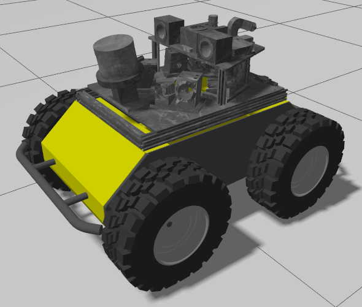
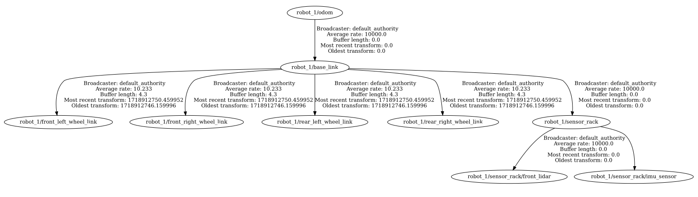
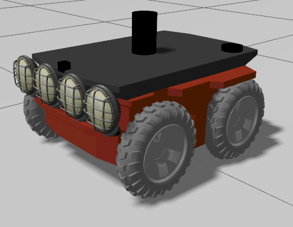
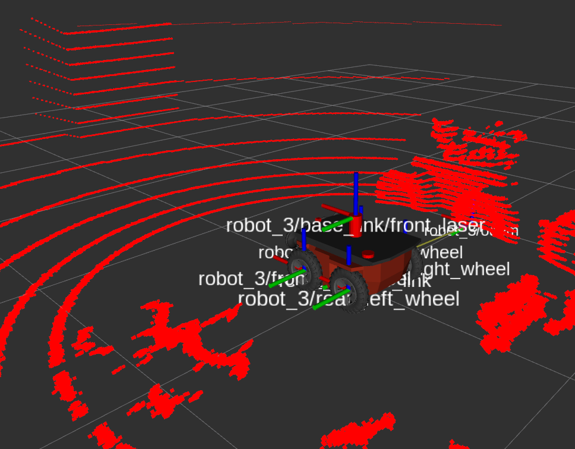
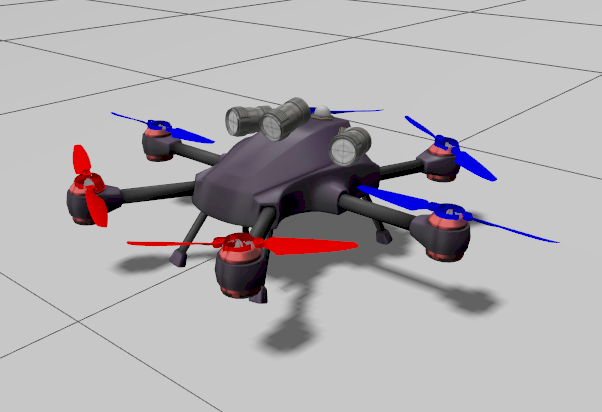
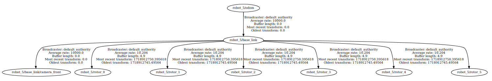
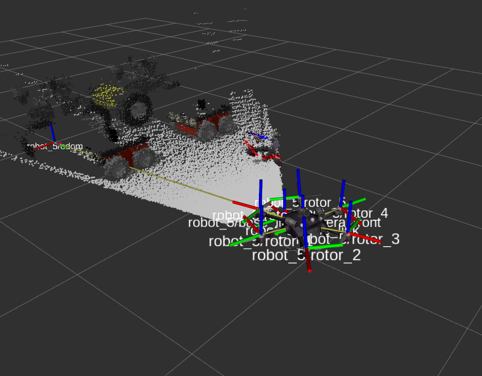

# Table of Contents

- [Table of Contents](#table-of-contents)
  - [Available Robots](#available-robots)
  - [Transform trees and sensors](#transform-trees-and-sensors)
  - [Clearpath Husky](#clearpath-husky)
  - [X2 UGV](#x2-ugv)
  - [X4 UAV](#x4-uav)

## [Available Robots](#available-robots)

This workspace is ready to work with two different UGVs and one type of UAV in Ignition Gazebo. All robots have been adapted to function correctly within the provided simulations. This adaptation is necessary because the way they are published in Fuel might not be appropriate for out-of-the-box use, given that Ignition Gazebo and RViz interpret models and topics differently.

All robots were downloaded from Fuel. I have adapted them to work out-of-the-box with ROS 2 Jazzy Jalisco and Ignition Gazebo using the ROS-Gazebo bridge. This includes parameterized namespaces, resource paths, and properly configuring the necessary topics to have full control over them.

## [Transform trees and sensors](#transform-trees-and-sensors)

The transformation tree is a crucial part of the system, and improper configuration can disrupt your experiments. Unfortunately, ROS 2 still has inconsistencies regarding how namespaces are handled by sensors and transforms defined via nodes and the .sdf files that define a robot.

To improve usability, I have configured all robots in this project with a transformation tree from a parameterized namespace assigned during launch. I added a static transform for ground truth pose in an odom frame, allowing you to correctly use and visualize the 3D and 2D lidars, the 3D model, and robots' models in software like RViz2. This setup makes them ready for experimentation in complex scenarios.

## [Clearpath Husky](#clearpath-husky)

I've configured the Husky robot with:

- IMU
- 3D Lidar
- 2D Lidar
- Odometry
- Ground truth pose

The transformation tree as follows.

I've also provided a basic RViz file to visualize this robot, its transforms, and model.

## [X2 UGV](#x2-ugv)

I've configured the X2 UGV with:

- IMU
- 3D Lidar
- 2D Lidar
- Odometry
- Ground truth pose

The transformation tree looks as follows.

I've provided a basic RViz file to visualize this robot, its transforms, and model.

## [X4 UAV](#x4-uav)

Differently, I've configured the X4 UAV with:

- IMU
- RGBD Camera
- Odometry
- Ground truth pose

The transformation tree as follows.

I've provided a basic RViz file to visualize this robot, its transforms, and model.

