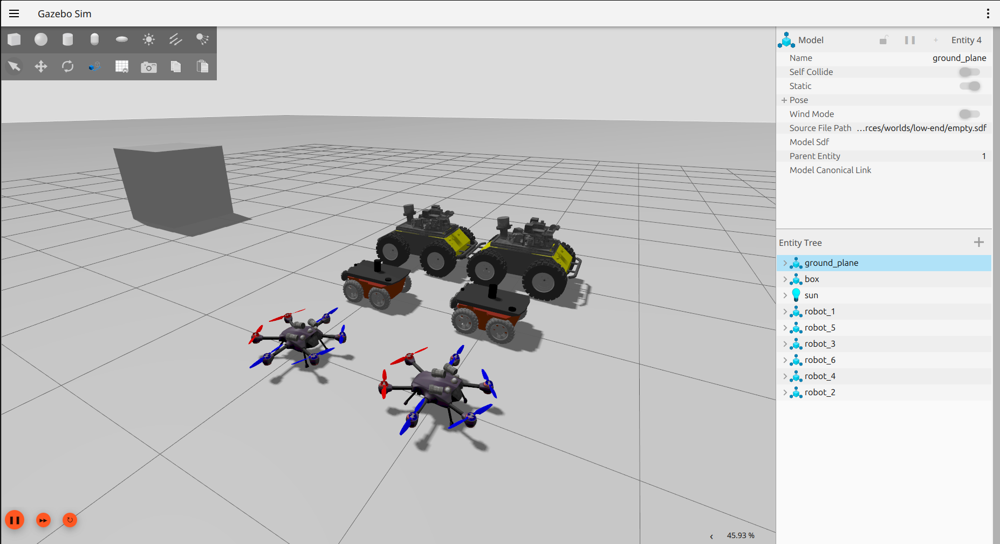
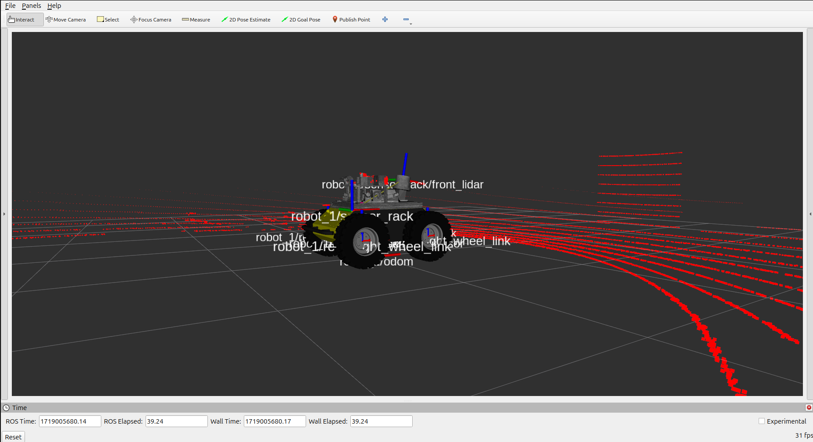
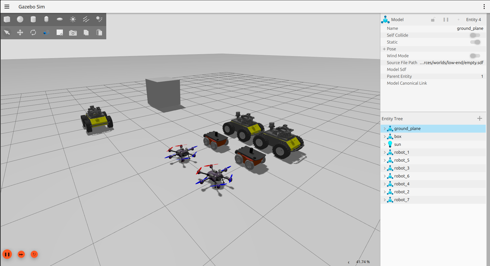

# Table of Contents

- [Table of Contents](#table-of-contents)
  - [Usage](#usage)
  - [Running the Main Launch File](#running-the-main-launch-file)
  - [Main Launch File](#main-launch-file)
    - [gazebo\_multi\_robot\_bringup\_launch.py](#gazebo_multi_robot_bringup_launchpy)
  - [Example Launch Files](#example-launch-files)
    - [gazebo\_single\_robot\_gz\_bridge\_config\_file\_launch.py](#gazebo_single_robot_gz_bridge_config_file_launchpy)
    - [gazebo\_single\_robot\_gz\_bridge\_no\_condig\_file\_launch.py](#gazebo_single_robot_gz_bridge_no_condig_file_launchpy)
  - [Robot Spawn Launch Files](#robot-spawn-launch-files)
    - [gazebo\_spawn\_drone\_x4\_launch.py](#gazebo_spawn_drone_x4_launchpy)
    - [gazebo\_spawn\_husky\_launch.py](#gazebo_spawn_husky_launchpy)
    - [gazebo\_spawn\_x2\_launch.py](#gazebo_spawn_x2_launchpy)
  - [Rviz Configuration Files](#rviz-configuration-files)
  - [Communicating with the Robots](#communicating-with-the-robots)
  - [Adding More Robots](#adding-more-robots)
  - [Extra](#extra)

## [Usage](#usage)

Before using the system, make sure that you followed the steps to configure ROS 2 Jazzy Jalisco from [here](working-environment.md).

## [Running the Main Launch File](#running-the-main-launch-file)

Before running the simulation, make sure you followed the steps I've described in the [working environment](working_environment.md) and that Ubuntu 24.04 and ROS 2 Jazzy Jalisco are properly installed and follow these steps.

1. Enter the ```Multi-robot-Sandbox``` folder in your terminal.
2. Compile the package and source its contents so your system can locate it.

    ```bash
    colcon build
    source install/local_setup.bash
    ```

3. Run the main simulation launch file.

    ```bash
    ros2 launch multi-robot-simulations gazebo_multi_robot_bringup_launch.py
    ```

4. Click on the play button on the botton left of the simulator.

If everything worked correctly, you should see the following scene:



I encourage you to explore the scene tree and also to open the Rviz configuration files I've setup for this launch file.

## [Main Launch File](#main-launch-file)

There is one main launch file in the ```src/multi-robot-simulations/launch``` folder that you can use to start your experiments or as a basis for any project you have. Unfortunately, ROS 2 launch architecture with Python has yet a long to before being easy-to-use and has some inconsistencies with substitutions, however, I've managed to code these files in such a way that they expect the robots' namespaces and resources paths to be injected into robots' *sdf* files and nodes to corretly configure their transformations, topics, bridge, and model resources, as I've descrived [here](robots.md). The main launch file is the following.

### [gazebo_multi_robot_bringup_launch.py](#gazebo_multi_robot_bringup_launchpy)

This is the main launch file brings up an environment with 2 Clearpath Husky robots, 2 X2 UGVs, and 2 X4 UAVs. Each robot will run its own odom publisher that I've prepared for this package. Furthermore, each robot will run its own ros-gazebo-bridge to expose a specific set of topics from Ignition Gazebo to ROS 2 Jazzy. This launch file also makes intensive use of substitutions to properly setup robots' namespaces and resources paths for the transfromations, topics, and visulization, which should spare you extra headache.

## [Example Launch Files](#example-launch-files)

I've configured two example launch files using Python that you can use as you like.

### [gazebo_single_robot_gz_bridge_config_file_launch.py](#gazebo_single_robot_gz_bridge_config_file_launchpy)

This is a launch example using configuration files for a single robot without substitution.

### [gazebo_single_robot_gz_bridge_no_condig_file_launch.py](#gazebo_single_robot_gz_bridge_no_condig_file_launchpy)

This is a launch example without using a configuration file for a single robot without substitution.

## [Robot Spawn Launch Files](#robot-spawn-launch-files)

### [gazebo_spawn_drone_x4_launch.py](#gazebo_spawn_drone_x4_launchpy)

This launch file spawns a X4 UAV drone with the correct transforms and namespaces.

### [gazebo_spawn_husky_launch.py](#gazebo_spawn_husky_launchpy)

This launch file spawns a Husky robot with the correct transforms and namespaces.

### [gazebo_spawn_x2_launch.py](#gazebo_spawn_x2_launchpy)

This launch file spawns a X2 UGV drone with the correct transforms and namespaces.

## [Rviz Configuration Files](#rviz-configuration-files)

There is one configuration file for each robot I've configured in the main launch file. They are located at ```src/multi-robot-simulations/config/rviz``` folder.

To run them, do the following.

1. Ensure that the simulation is running as [described](#running-the-main-launch-file).
2. Open a new terminal.
3. Open RViz 2 with the following command in your new terminal.

    ```bash
    rviz2
    ```

4. Go to the top menu of RViz and load one of the configuration files provided.

If everything works correctly, you should see something similar to this.



## [Communicating with the Robots](#communicating-with-the-robots)

To communicate with the robots through ROS 2, you can check the available topics by running the following.

1. Ensure that the simulation is running as [described](#running-the-main-launch-file).
2. Open a new terminal.
3. Run the following command on your new terminal.

    ```bash
    ros2 topic list
    ```

If everything was done correctly, you should see the following topics in your terminal

```bash
/clock
/parameter_events
/robot_1/cmd_vel
/robot_1/imu
/robot_1/joint_states
/robot_1/lidar/points
/robot_1/lidar/scan
/robot_1/odometry
/robot_1/pose
/robot_1/robot_description
/robot_2/joint_states
/robot_2/pose
/robot_2/robot_description
/robot_3/cmd_vel
/robot_3/imu
/robot_3/joint_states
/robot_3/lidar/points
/robot_3/lidar/scan
/robot_3/odometry
/robot_3/pose
/robot_3/robot_description
/robot_4/cmd_vel
/robot_4/imu
/robot_4/joint_states
/robot_4/lidar/points
/robot_4/lidar/scan
/robot_4/odometry
/robot_4/pose
/robot_4/robot_description
/robot_5/camera/camera_info
/robot_5/camera/depth_image
/robot_5/camera/image
/robot_5/camera/points
/robot_5/cmd_vel
/robot_5/imu
/robot_5/joint_states
/robot_5/odometry
/robot_5/pose
/robot_5/robot_description
/robot_6/camera/camera_info
/robot_6/camera/depth_image
/robot_6/camera/image
/robot_6/camera/points
/robot_6/cmd_vel
/robot_6/imu
/robot_6/joint_states
/robot_6/odometry
/robot_6/pose
/robot_6/robot_description
/rosout
/tf
/tf_static
```

Since robots are properly configured with their namepsace, you should be able to control and visualize them apropriately.

## [Adding More Robots](#adding-more-robots)

To add more robots simply run one of the robot spawn launch files I've configured specifying a namespace different from the ones from the robots already running. For example, if you wanna add an extra Husky under the namespace robot_7 at x=3, y,3, z=0.5, run the following.

```bash
ros2 launch multi-robot-simulations gazebo_spawn_husky_launch.py namespace:=robot_7 x:=3.0 y:=3.0 z:=0.5
```

if the robots loads correctly, the launch file should handle the transformations and parametrization stuff for you, publishing the correct topics under the specified namespace. You should see the following in your Ignition Gazebo.



You should also see the following extra topics available to communicate with your robot if you run the command ```ros2 topic list``` in a terminal.

```bash
/robot_7/cmd_vel
/robot_7/imu
/robot_7/joint_states
/robot_7/lidar/points
/robot_7/lidar/scan
/robot_7/odometry
/robot_7/pose
/robot_7/robot_description
```

## [Extra](#extra)

ROS 2 is yet an experimental environment that is constantly evolving due to the great community, it has much to improve, however the tools it provides suffice for most use cases. Some hacks had to be made to work with the parameterized launch files and robot configurations to make them integrate seamless with Ignition Gazebo and RViz and to work in a **multi-robot** setting. 

Finally, I hope that this could make you skip the stuff that some people might find booring! You can add and use as many robots your computer is able to handle and start doing your stuff, so keep playing around! :)
